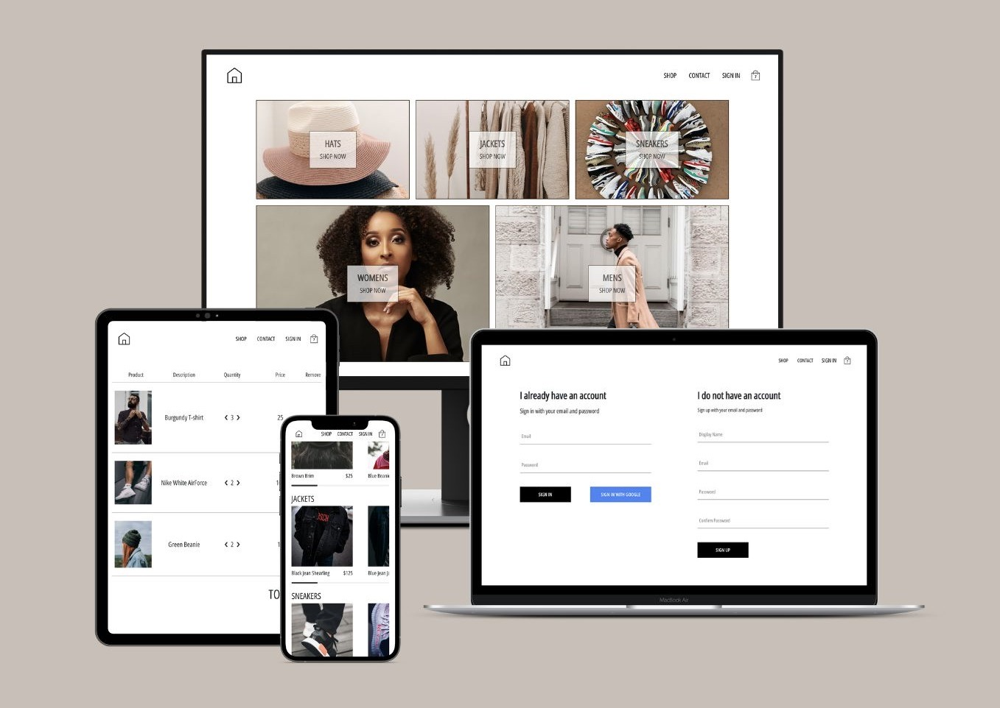

# E-Commerce React App
**View project live [HERE](https://seun-a-ecommerce.netlify.app)!**

This is a sample **React Js** e-commerce web application. 

The user can see product collections and individual products, sign in and sign up using either **email** or **Google**.

#

## Technologies Used:
- [**React**](https://reactjs.org)
- [**Redux**](https://redux.js.org)
- [**React Router**](https://reactrouter.com)
- [**Firebase**](https://firebase.google.com)
- [**Sass**](https://sass-lang.com)
- [**Stripe**](https://stripe.com/en-gb-us)
- [**CSS in JS (Styled Components)**](https://github.com/styled-components/styled-components) 

#

## Functionalities:
- Google Sign In / Sign Up
- Email Sign In / Sign Up
- Cart
- Checkout
- Payment (Stripe Integration)

